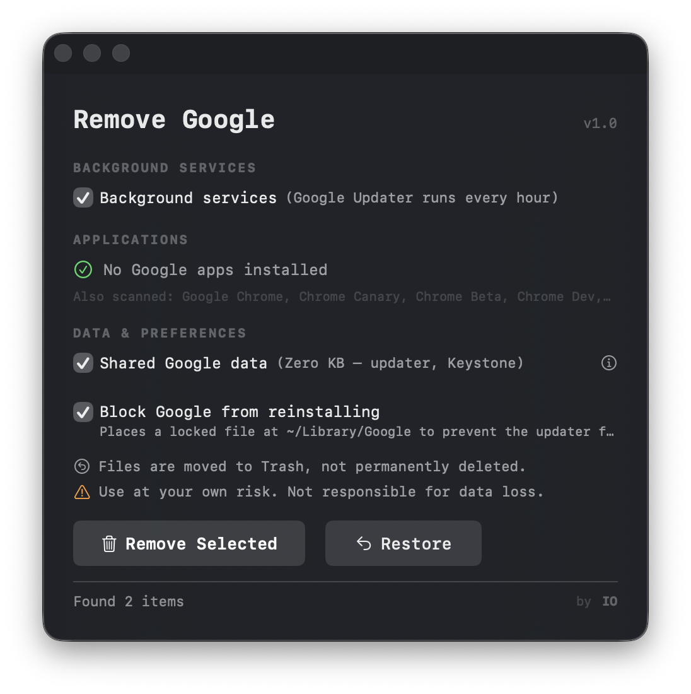

# Remove Google from macOS

A native macOS app that finds and removes all Google software — apps, the hidden background updater, caches, preferences, and system services. Everything goes to Trash; nothing is permanently deleted.



## Download

**[Download Remove Google.app](https://github.com/isolson/remove-google-macos/releases/latest)**

Or build from source:

```bash
git clone https://github.com/isolson/remove-google-macos.git
cd remove-google-macos
bash build.sh
open "build/Remove Google.app"
```

## How it works

1. Open the app — it scans your Mac automatically
2. Review what it found, uncheck anything you want to keep
3. Click **Remove Selected**
4. Reboot recommended

Each app includes its own data (caches, preferences, containers). Unchecking an app keeps its data intact. Click **Restore** to put everything back from Trash.

## Is it safe?

- Everything is moved to Trash, not permanently deleted
- Per-app checkboxes — you choose exactly what goes
- Built-in restore from Trash
- The app stores nothing; delete it when done

## Further reading

- [Architecture and technical details](docs/ARCHITECTURE.md)
- [What Google installs on your Mac](docs/GOOGLE_ON_MACOS.md)

## Signing

```bash
bash build.sh --sign "Developer ID Application: Your Name (TEAM_ID)"
```

See [docs/ARCHITECTURE.md](docs/ARCHITECTURE.md) for notarization steps.
